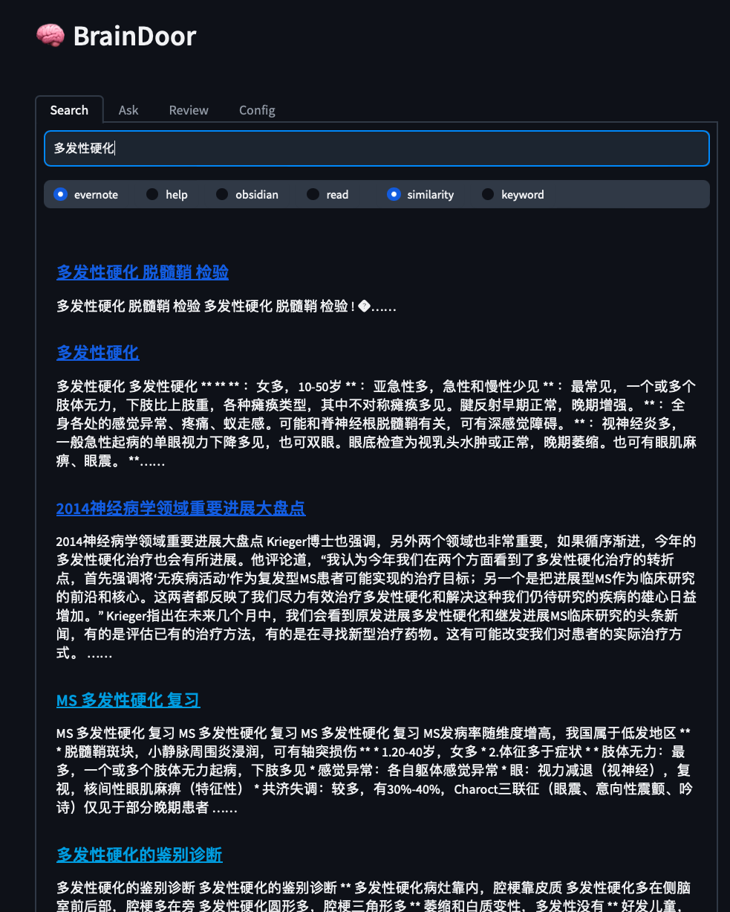
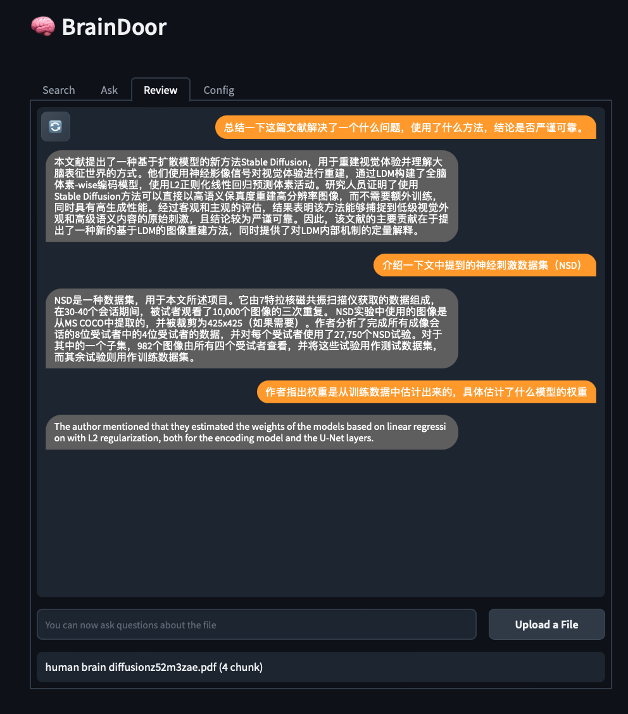

# 🧠 大脑门儿 Braindoor

中文 | [English](doc/README_EN.md)

## 概述

大脑门儿可以方便的用本地文件来构建ChatGPT的外部知识库。支持自然语言搜索、问答和全文分析本地文档。


### 常见用例

- 用自然语言搜索个人文档或笔记
- 用本地文本资料构建一个特定领域的问答机器人
- 用chatgpt对长文本分析和问答

### 主要特点

- 灵活的构建本地的知识库，支持（txt，md，html，pdf，docx）。
- 增量更新入库文件
- 提供一个Web UI。Search模块和Ask模块引用的本地文档支持在浏览器中直接打开
- 长文档的全文深度阅读

----

### 安装和启动

1、创建一个python3.9的conda虚拟环境

```shell
conda create -n braindoor python=3.9
```

2、安装依赖包

```shell
git clone https://github.com/newfyu/Braindoor.git
cd Braindoor
conda activate braindoor
pip install -r requirements.txt
conda install -c conda-forge faiss-cpu
```

3、启动

```shell
python app.py
```

**浏览器中打开地址 127.0.0.1:7086，然后在Config标签中配置你的openai key才能正常使用！** 
国内用户可能还要在Config中配置http代理服务器地址，或则开全局代理。    

---

### 创建知识库 Config / Create: new knowledge base

- 在大脑门儿中，一个向量仓库及它索引的文件夹，称为一个knowledge base。     

- 在Config --> Create a new knowledge base中，填写库名和一个本地文件夹路径，文件类型即可创建一个knowledge base。

- 创建时只允许加入一个索引文件夹，但创建成功后可以在update中添加更多的文件夹

- chunk size是将文件切片后嵌入的大小，如果你希望进行问答，切片大小1000-2000是合适的。超过2000容易突破gpt3.5-turbo的token限制。

> 例：假设我想用我的obsidian笔记构建一个知识库，笔记路径为 `~/obsidian/myvult`。 
> 
> 1. 填写库名如: "mybase“
> 2. `~/obsidian/myvult`地址粘贴到 "Directory“文本框中
> 3. 文件类型选择"md"和“txt“
> 4. 点击Create按钮

---

### 更新知识库 Config / Update existing knowledge base

- 当索引的文件夹内容有改动，点击update按钮检查同时更新向量仓库
- 改变知识库的一些配置后，也需要点击"Save base config"按钮
- 可以为一个知识库增加更多的索引文件夹

> 例：我想把我的印象笔记也加入知识库中。
> 
> - 先使用印象笔记的导出功能把所有笔记用单个html的格式导出到任意文件夹比如`~/evernote` 中。
> 
> - 然后在`Add a new directory to current knowledge base`文本框中，填写`~/evernote`，类型选择`html`。 
> 
> - 点击 "Save base config"按钮。确认信息无误后，点击“Update"更新。

> 删除知识库: 在bases文件夹中直接删除对应的.base文件

---

### 搜索 Search

搜索模块主要用于检索你的知识库。选择一个知识库，使用任意自然语言搜索你的库，将会找到相似的文档。支持浏览器中直接打开文档。



---

### 问答 Ask

- 一个chatbot，将依据你的知识库中的内容作为证据来来回答你问题
- 默认情况下会参考库中最相似的文档片段（docoment chunk）
- 可以增加answer depth来让chatbot去参考更多相似文档
- 支持连续的问答，但不同的主题尽可能重新开启对话
  

> default表示不使用本地知识库，返回的是chatgpt的原始回答.

> help是一个示例knowledge base，存储的即本文

---

### 全文阅读 Review：

- 传入一份文档后即可针对该文档自由提问
- 和Ask不同的是，Review模块不会仅参考向量相似性匹配的文档片段，而是完整的阅读全文后给出答案
- 全文速度较慢，但不会遗漏信息，威力巨大
- 适用于详细的总结分析一份长文档，或辅助阅读文献
- 由于token限制，Review模块取消了联系上下文对话，仅对最近请求做出反应。所以每次提问都要清晰完整



---

### 开销

需要准备openai的key。入库和Search使用text-ada-001模型。Ask和Review使用gpt-3.5-turbo模型，这两个模型费用都很低。但如果你的知识库很庞大，仍需要注意入库的开销。另外，增加answer_depth和频繁的使用review功能也会根据本地文本的长度相应的增加开销。

---

### 配置

常用配置可以在config标签中设置
还有一些高级参数，不建议改动。如果需要可以在config.yaml文件中修改

| 参数名                  | 类型    | 说明                                                                         | 默认值   |
| -------------------- | ----- | -------------------------------------------------------------------------- | ----- |
| key                  | str   | 填写openai的key                                                               | ‘‘    |
| rate_limit           | int   | 由于openai有请求速率限制，在创建向量仓库时候如果短时间有大量请求，很容易被限制访问。1表示发送一个请求后休息1秒。只在创建和更新知识库时生效。 | 1     |
| proxy                | str   | 可在请求openai api时启用代理。填写你的http代理地址，比如："http://127.0.0.1:1087"                | ‘‘    |
| search_topk          | int   | 作用于Search模块。搜索返回的结果数。                                                      | 20    |
| result_size          | int   | 作用于Search模块。预览文字的长度。                                                       | 300   |
| answer_depth         | int:  | 作用于Ask模块，chabot在回答时，读取本地文档片段的最大数量。默认1表示只会读取最相似的一个片段。                       | 1     |
| max_context          | int   | 作用于Ask模块。上下文最大token值。                                                      | 1000  |
| max_l2               | float | 作用于Ask模块。匹配相似本地片段时允许的最大L2距离。                                               | 0.4   |
| HyDE                 | bool  | 作用于ASK模块。chatbot在匹配本地文档前，根据你的问题预先用chatgpt生成一个初步回答，然后再匹配。可增加准确性，但也会增加一点开销。  | false |
| review_chunk_size    | int   | 作用于Review模块。对长文本分割时每块的最大token值。                                            | 2000  |
| review_chunk_overlap | int   | 作用于Review模块。长文本分割时重叠的token数。                                               | 50    |

---

### 主要第三方依赖

- 语言模型：chatgpt
- 文本拆分：langchain
- 向量仓库：faiss
- Web界面：gradio
