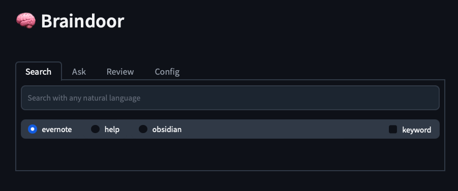
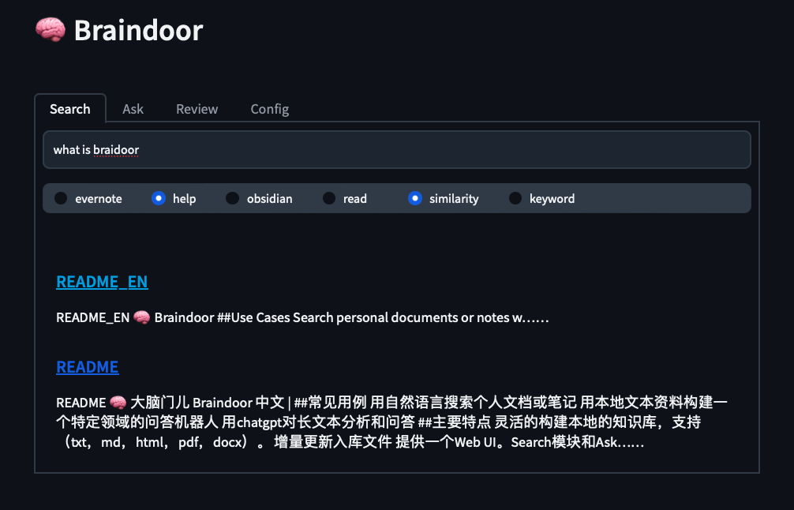
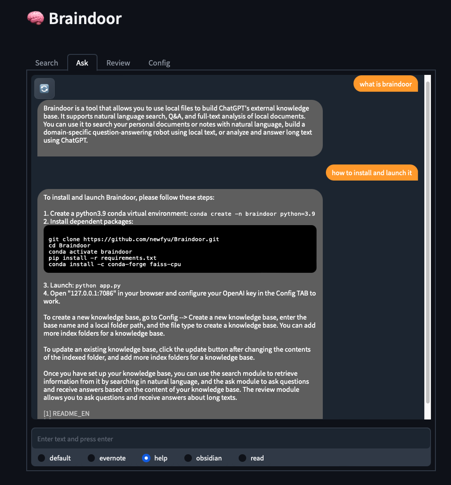
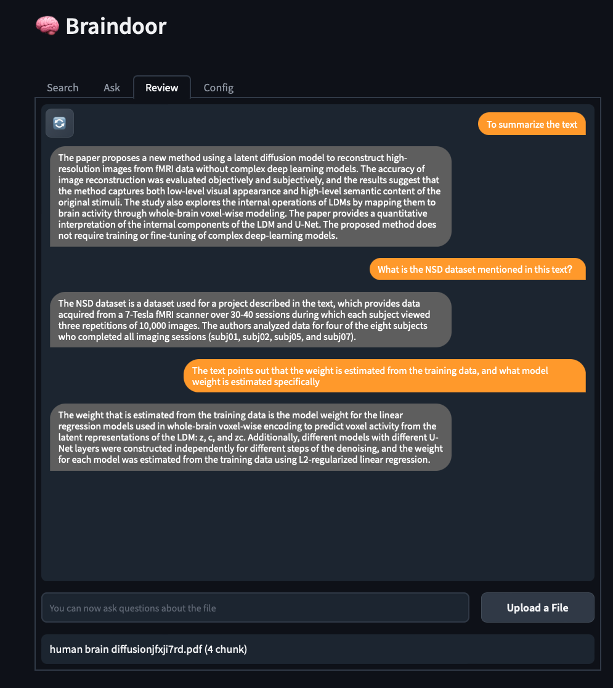

# 🧠  Braindoor

[中文](../README.md) | English

## Overview

Braindoor can easily use local files to build ChatGPT's external knowledge base. Support natural language search, Q&A and full text analysis of local documents.



### Use Cases

- Search personal documents or notes with natural language
- Build a domain-specific question answering robot using local text
- Use chatgpt to analyze and answer long text

### Features

- Flexible construction of local knowledge base. Support  txt, md, html, pdf, docx
- Incremental update
- Provides a Web UI. Documents referenced by Search module or Ask module can be opened directly in the browser.
- Full-text deep review

----

### Installation and launch

1、Create a python3.9 conda virtual environment

```shell
conda create -n braindoor python=3.9
```

2、Install dependent packages

```shell
git clone https://github.com/newfyu/Braindoor.git
cd Braindoor
conda activate braindoor
pip install -r requirements.txt
conda install -c conda-forge faiss-cpu
```

3、Launch

Windows, Liunx

```shell
python app.py
```

Mac OS has added a toolbar switch that can also be run with the following command

```shell
python run.py
# Background running
# nohup python run.py& 
```

Open `127.0.0.1:7086` in browser and configure your `openai key` in the `Config` TAB to work!  

---

### Create a new knowledge base

- In  braindoor, a vectorstore and its indexed folders are called a knowledge base  

- When the contents of the index folder are changed, `Load` the knowledge base created in `Config/update knowledge base`. Click the `Update` button again to check and update

- Only one index folder is allowed to be added during creation, but more folders can be added in update after creation is successful

- Chunk size is the max size of a document chunk. If you want to answer questions, the size of 1000-2000 is appropriate. Over 2000, it is easy to break the token limit of gpt3.5-turbo

> Example: Suppose I want to build a knowledge base with my obsidian notes.  My obsidian note location is `~/obsidian/myvult`. 
> 
> 1. First fill in a knowledge base name, such as: `mybase`
> 2. `~/obsidian/myvult`Paste into the `Directory` textbox
> 3. Select `md` and `txt` for file type
> 4. Then click the `Create` button

---

### Update existing knowledge base

- When the contents of the indexed folder have changed, click the `Update` button to check the changes and update the vectorstore.
- After changing some configurations of the knowledge base, you need to click the `Save base config` button
- You can add more index folders for a knowledge base

> Example:：I also want to add my Evernote to the knowledge base。
> 
> 1. First, use EverNote's export feature to export your notes in html format to any directory such as `~/evernote` 
> 
> 2. In the `Add a new directory to current knowledge base` text box, enter `~/evernote`, Type select `html`.
> 
> 3. Click the `Save base config` button. After confirming the information, click `Update` to update it. 

> Delete a knowledge base: directly delete the corresponding `.base` file in the bases folder

---

### Search

The search module is used to retrieve your knowledge base. Select a knowledge base and search in any natural language to find similar documents. It supports opening documents directly in the browser.



---

### Ask

- Ask module is a chatbot, which will use the content in your knowledge base as evidence to answer your questions

- By default, the most similar document chunk in the base is referenced

- You can increase the answer depth to allow chatbot to read more similar document chunks

- Support continuous Q & A, but reopen the dialogue on different topics as much as possible



> "Default" means that the local knowledge base is not used, and the original answer of chatgpt is returned.

> "help" is an example knowledge base, stored for this readme.md

---

### Review

- After passing in a document, you can freely ask questions about the full text of the document
- Unlike Ask, the Review chatbot will not only read the document chunk matched by vector similarity, but will read the full text for each question and give the answer
- Full text reading does not omit information, which is slow but powerful
- It is suitable for detailed summary and analysis of a long document or auxiliary reading of literature



> Due to token restrictions, Review canceled the contact context dialog and only responded to the latest request. So every question should be clear and complete

---

### Overhead

The openai key needs to be prepared. The text-ada-001 model is used for create vectorstores and Search. Ask module use the gpt-3.5-turbo model, both of which cost very little. But be aware, if you have a large knowledge base, be aware of the cost of access. In addition, increasing answer_depth value and frequent use Review can add overhead depending on the length of the local text.

---

### Configuration

General configuration can be set in the config tab
There are some advanced parameters, which are not recommended to be changed. Modify it in the config.yaml file if necessary

| Parameter name       | Type  | Description                                                                                                                                                                                                                                                                                  | Default |
| -------------------- | ----- | -------------------------------------------------------------------------------------------------------------------------------------------------------------------------------------------------------------------------------------------------------------------------------------------- | ------- |
| key                  | str   | Fill in your openai key                                                                                                                                                                                                                                                                      | ‘‘      |
| rate_limit           | int   | Because openai has a request rate limit, it is easy to restrict access if there are a large number of requests in a short period of time when creating a vectorstore. 1 means a break of 1 second after sending a request. Takes effect only when the knowledge base is created and updated. | 1       |
| proxy                | str   | The proxy can be enabled when the openai api is requested. Enter your http proxy address, for example: "http://127.0.0.1:1087"                                                                                                                                                               | ‘‘      |
| search_topk          | int   | For the Search module. The number of results returned by the search.                                                                                                                                                                                                                         | 20      |
| result_size          | int   | For the Search module. Preview the length of the text.                                                                                                                                                                                                                                       | 300     |
| answer_depth         | int:  | For the Ask module. Chabot reads the maximum number of local document chunks when answering. The default of 1 means that only the most similar chunk will be read.                                                                                                                           | 1       |
| max_context          | int   | For the Ask module. Maximum number of token for context.                                                                                                                                                                                                                                     | 1000    |
| max_l2               | float | For the Ask module. Maximum L2 distance allowed when searching similar document chunk                                                                                                                                                                                                        | 0.4     |
| HyDE                 | bool  | For the Ask module. Chatbot uses chatgpt to generate a preliminary answer and then matches the similar local document. It will increase accuracy, but it will also add a little overhead.                                                                                                    | false   |
| review_chunk_size    | int   | For the Review module, the maximum token number of each block when splitting the long text.                                                                                                                                                                                                  | 2000    |
| review_chunk_overlap | int   | The number of overlapping tokens when splitting long text.                                                                                                                                                                                                                                   | 50      |

---

### Main third-party dependencies

- Language model: chatgpt
- Text splitting: langchain
- Vector stores: faiss
- Web interface: gradio
